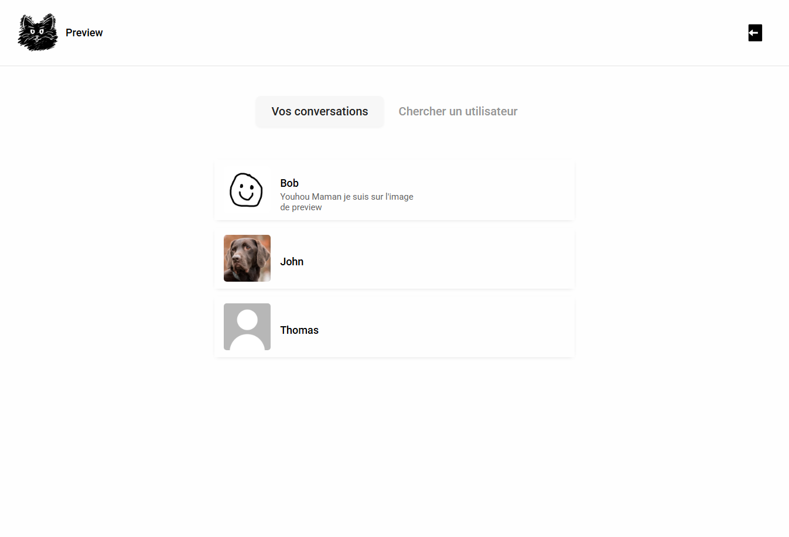

# Toki

Toki est une application de messagerie instantanée au design minimaliste proposant les fonctionnalités suivantes :

- Création de compte
- Vérification d'email
- Ajout d'une photo de profil
- Changement de nom d'utilisateur et bio
- Recherche d'utilisateurs par pseudo
- Conversations privées avec d'autres utilisateurs
- Suppression de messages



**L'application est séparée en deux repositories différents, vous consultez actuellement la partie Frontend de l'application.**

[Cliquez pour accéder au repository du Backend](https://github.com/NzlThomas/toki-backend)

---

## Stacks utilisées

### Frontend

- React
- React Router DOM
- Axios
- Context API
- Modules CSS

### Backend

- Node.js
- Express
- Prisma
- PostgreSQL
- Multer
- Sharp
- JWT
- Cloudinary

## Installation

### Cloner le projet

```bash
git clone git@github.com:NzlThomas/toki-frontend.git
```

### Installer les dépendances

A la racine du projet :

```bash
npm i
```

### Créer et remplir les variables .env

```env
VITE_API_URL="URL de votre backend"
```

### Lancer le frontend

```bash
npm run dev
```

### Initialisation du Backend

[Référez vous au README de ce repository](https://github.com/NzlThomas/toki-backend)
